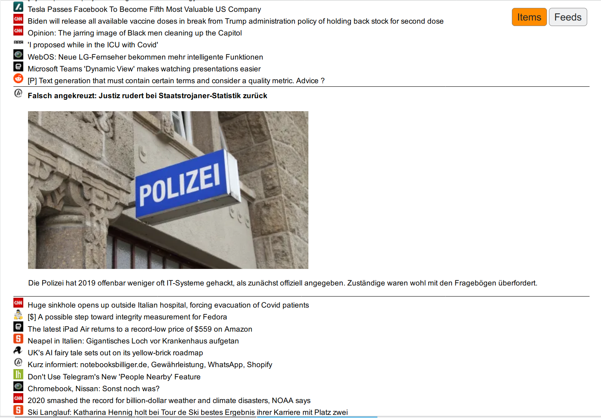
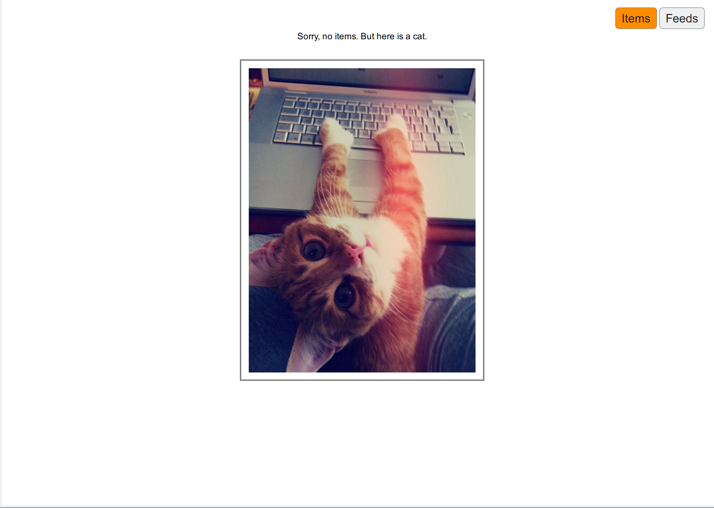
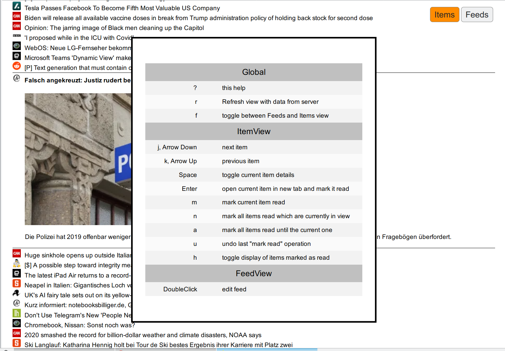
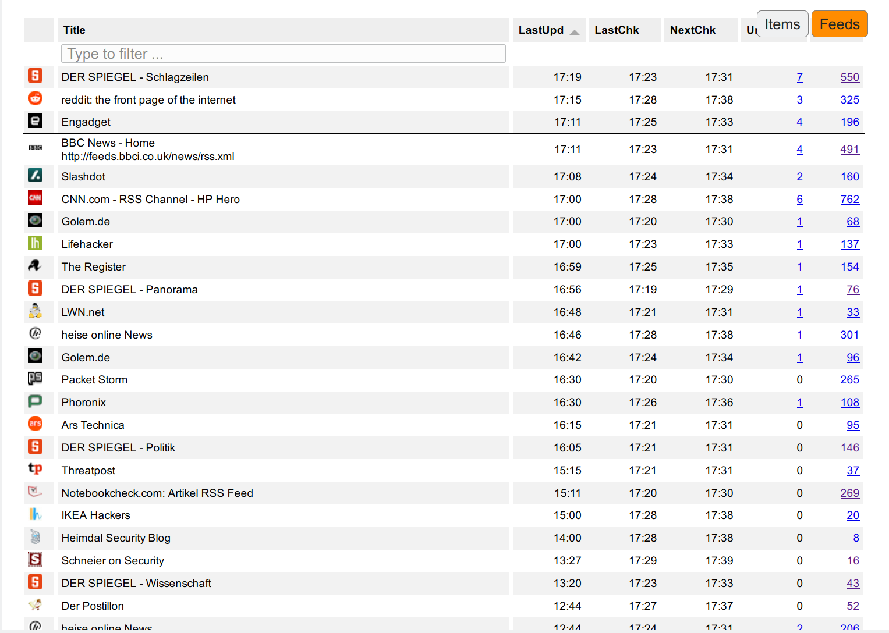
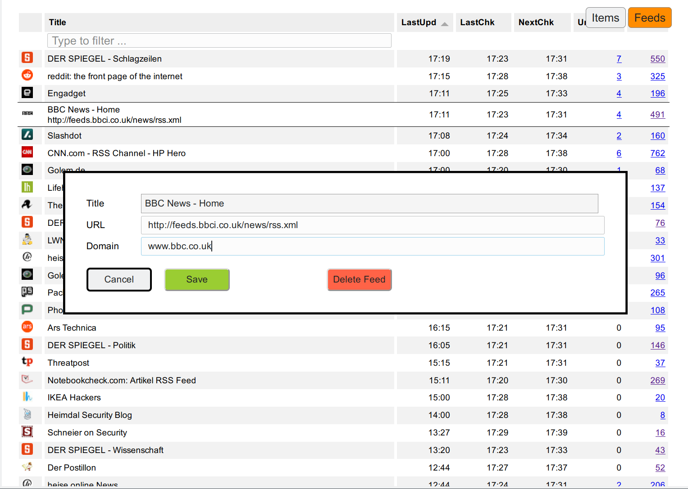

# Personal, web based RSS reader with full keyboard control

## Use case

- read information based on RSS feeds
- in a fast and efficient and friendly way
    - full keyboard control
    - compact display of items for fast processing
    - cute cat picture once everything is read - powered by cataas.com
- deals with duplicate entries from multiple RSS feeds, i.e. keep only one
- uses SQLite, i.e. no extra DB engine needed
- currently not recommended for mobile phones, since keyboard control cannot be
  used there

## General use

- load application and press '?' for the keyboard shortcuts
- to add a feed: 
    - switch to feed view 
    - enter or paste feed URL in "search" input 
    - a "Add Feed" button will magically appear for a valid URL
    - klick it, confirm
    - it will be initially added with NO TITLE, wait a while to load the feed
      (reload will keep filter)
- Enjoy

## Setup

### Software installation

- nodejs is needed, tested with v10.19.0 on Ubuntu 20.04
- Typescript compiler is needed, tested with 3.8.3 on Ubuntu 20.04
- to install these on Ubuntu 20.04: `apt install nodejs node-typescript`

### Load dependencies and compile

    $ (cd server && npm i && tsc)
    $ (cd client && npm i && tsc && npx webpack)

### Startup and Run

    $ (cd server && node --insecure-http-parser server.js)

Note that `--insecure-http-parser` is needed in case a feed has an invalid
HTTP header (as currently the case with https://www.sans.org/blog/feed.xml)

Server listens on http://localhost:3000/ and will update feeds in the
background. Debug output (mostly about feed updates) is logged to stdout. 

## Command Line Tools

For mass operation it might be easier to use the command line, even though this
can be done from the GUI for single feeds too:

    (cd server && node addfeed.js feed-urls+) # Add feeds
    (cd server && node delfeed.js feed-urls+) # Delete feeds

Feeds will be updated automatically after some time, depending on last activity
in feed. To force an update of all feeds now:

    (cd server && node updfeed.js)

### Display of favicons for sites

Domain specific favicons are retrieved using
`https://www.google.com/s2/favicons?domain=...` and then stored in the database.
It is possible to override these by putting a PNG in `server/favicon/domain.png`.

There are generic feed collection services like feedburner. To distinguish the
different feeds by icon it is possible to set a domain to use for this Feed.
This can be done by editing the feed in the FeedView (double-click to feed).

The feed icon is retrieved based on the domain of the feed, unless different
domain is set there. The item ucon is retrived based on the domain of the item,
unless a different icon is set for the feed (since feedburner etc use their own
domain in the item links too).

The icons are served with instructions for client-side caching, so any change
might need a hard refresh to clear the relevant parts of the cache.

## Security and Privacy

- There is no authentication and no HTTPS done. Recommended setup when installed
  on a public system is behind some reverse proxy which terminates HTTPS and
  requires some authentication (like basic authentication or client certificate).
- Items are sanitized and inputs are checked, so that hopefully no XSS is possible
- Content-Security-Policy is used, although it currently allows unsafe-inline.
  The latter is needed for interaction with a private browser extension (to open
  a link in a new tab but in the background). This might be further hardened in
  client/index.html.
- Referrer-Policy is set to same-origin, so that no HTTP-Referer is send when
  opening or including content from external sites.

## Open Tabs in Background

To have a workflow where tabs from the reader are opened in the background
one can use the browser extension in webext-background-tab/. See there for
installation.

## How it looks like

### ItemView - List of new items to read

Full keyboard navigation in list. <Space> to toggle inline details. <Enter> to
open link in new tab.

### ItemView - Everything done 

If no more items to show it gets a cat picture from cataas.com.

### ItemView - Help  

Pressing '?' shows the help

### FeedView - List of all Feeds

For each feed it shows the number of total and unread items in DB. One can
follow these links to get an ItemView with only the items for this Feed. When
following the "total" the already read links are shown too. Hover over a feed
shows more details (the URL).

The view can be filtered by entering something in the filter input. If a URL is
entered there and there is no feed matching this URL yet it will offer to add
this URL as new feed.

### FeedView - Edit Feed

Double-Click in a feed makes it possible to edit the feed information URL and
domain for icon. Title is retrieved from the feed itself.

